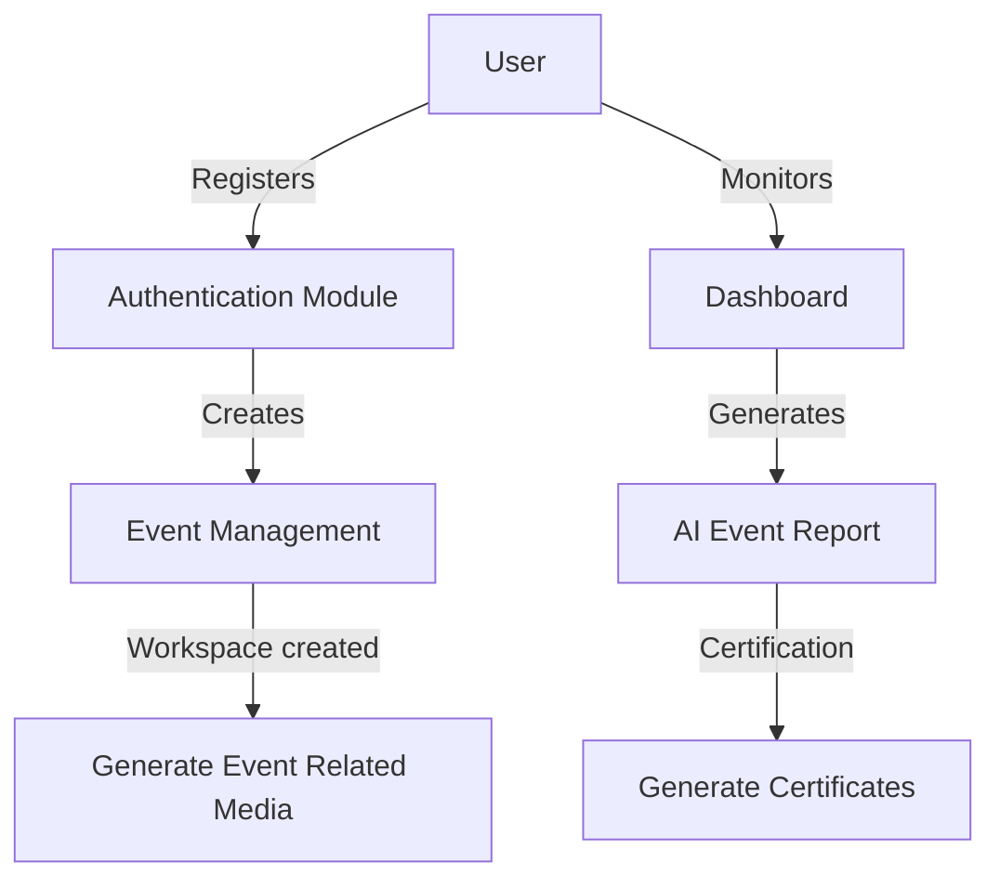

# Welcome to EventEase

## Introduction

EventEase is a modern event management platform designed to simplify the process of organizing, managing events. With a focus on usability and flexibility, EventEase allows users to create events, plan events, create writeups,view event report, generate certificates. Whether you're planning a small meetup or a large conference, EventEase streamlines the entire event lifecycle reduces your workload on what's not necessary so you can focus on what's important.

## Features

- User authentication and secure registration
- Event creation, editing, and deletion
- Workspace for AI Powered Writeups to grow your reach
- AI management, faster and accurate
- Responsive user interface for desktop and mobile
- Dashboard for organizers to monitor event metrics
- AI powered Event Report for Faster work by management Teams

## Requirements

To run EventEase, ensure your environment includes the following:

- Node.js (version 14.x or higher)
- npm (version 6.x or higher)
- Modern web browser (for frontend)
- (Optional) Docker for containerized deployment

## Installation

Follow these steps to install and run EventEase locally:

1. Clone the repository:
   ```bash
   git clone https://github.com/iamrobby/EventEase.git
   cd EventEase
   ```
2. Install dependencies for the backend:
   ```bash
   cd backend
   npm install
   ```
3. Install dependencies for the frontend:
   ```bash
   cd ../frontend
   npm install
   ```
4. Set up your Firebase instance and update the configuration in `firebase.jsx`.
5. Start the backend server:
   ```bash
   npm start
   ```
6. Start the frontend server:
   ```bash
   npm run dev
   ```
7. Access the application at `http://localhost:5137`.

## Usage

Once installed, you can:

- Register as a new user or log in with existing credentials.
- Create a new event by providing details such as title, description, date, and location.
- Publish the event and share the invite link with AI Powered Writeups
- Manage event registrations and track attendee status through the organizer dashboard.
- Get Event Report by the End of Event

### Example Workflow



## Configuration

Customize the application by editing the configuration files:

- **Backend:**  
  Edit `firebase.jsx` to set your own Firebase related customization
- **Frontend:**  
  Update `App.jsx` for API endpoint and environment settings.
- **Environment Variables:**  
  Use `.env` files in both `backend` and `frontend` directories for secrets and sensitive data.

**other details**
`app.py`: Generates the automation flow for the Event report Generation as well as automatic certificate generation with customizable templates

## Contributing

We welcome contributions from the community! To contribute:

- Fork the repository and create your feature branch.
- Commit your changes with clear, descriptive messages.
- Push to your branch and open a pull request.
- Ensure your code follows the existing style and passes all tests.
- Participate in code review and respond to feedback.

### Contribution Guidelines

- Write clear and concise commit messages.
- Include tests for new features or bug fixes.
- Update documentation for any API or behavior changes.
- Respect the code of conduct and community guidelines.

---

### Future Updates will include:
1) AI based Attendance marking for QR codes
2) Let user choose their own certificate templates, allowing further customization
3) AI Based Live Crowd and people Manager
----

Thank you for using EventEase. We hope it makes your event management effortless and enjoyable!
